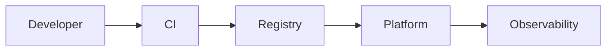

# Project Name

Одно предложение: какую production-проблему решает проект и что реализовано.

## Engineering Goal

- Контекст и пользователь системы.
- Функциональные границы.
- Availability, latency, RPO/RTO и security requirements.

## Architecture



## Tech Stack

| Area | Tools | Why |
|---|---|---|
| Runtime |  |  |
| Delivery |  |  |
| Security |  |  |
| Observability |  |  |

## Quick Start

```bash
make bootstrap
make test
make demo
make destroy
```

Указать prerequisites, ожидаемый результат и полное удаление ресурсов.

## Delivery Pipeline

Описать stages, artifacts, environments, approvals, rollback и trust boundaries.

## Security Controls

| Risk | Control | Verification | Limitation |
|---|---|---|---|
|  |  |  |  |

Ссылки на `SECURITY.md` и `docs/threat-model.md`.

## Reliability and Observability

- SLI/SLO.
- Dashboards и alerts.
- Backup/restore.
- Graceful degradation.
- Capacity assumptions.

## Failure Scenarios

| Scenario | Symptom | Detection | Recovery |
|---|---|---|---|
|  |  |  |  |

Ссылки на runbooks и postmortems.

## Results

Измеримые build/deploy/recovery time, latency, scan findings и resource usage.

## Decisions and Trade-offs

Ссылки на ADR и минимум одна отвергнутая альтернатива.

## Roadmap

- [ ] Следующее содержательное улучшение.
- [ ] Ограничение, которое пока не устранено.

## English Summary

Короткий абзац: problem, solution, security/reliability evidence и quick-start command.
